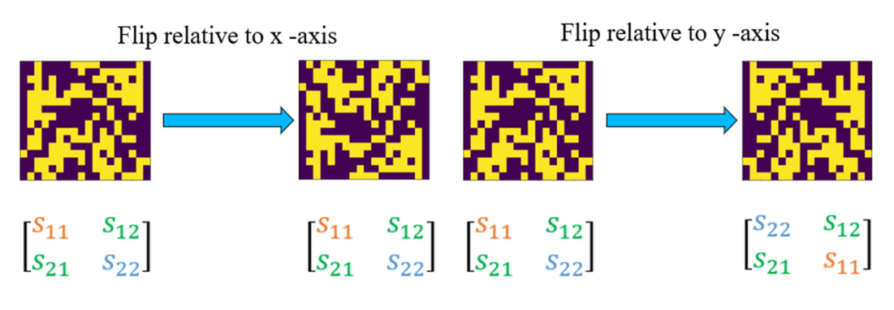
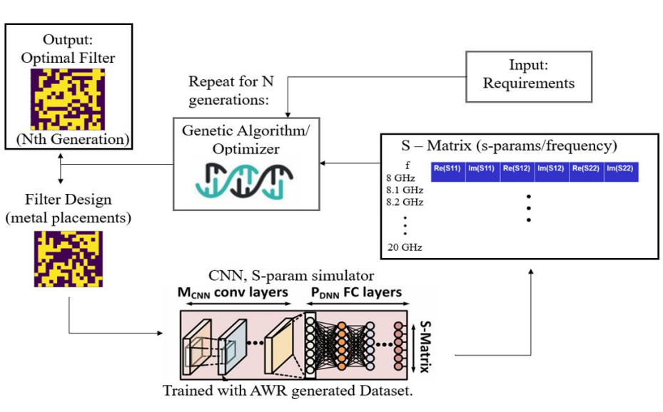
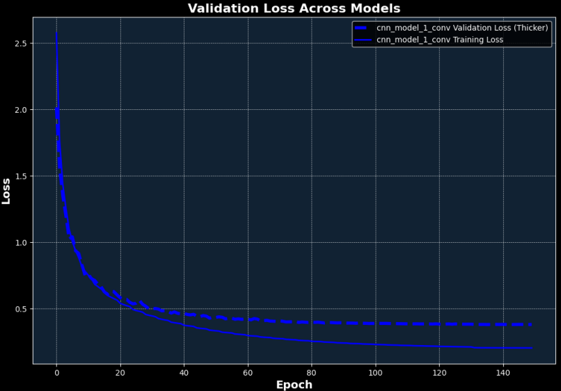
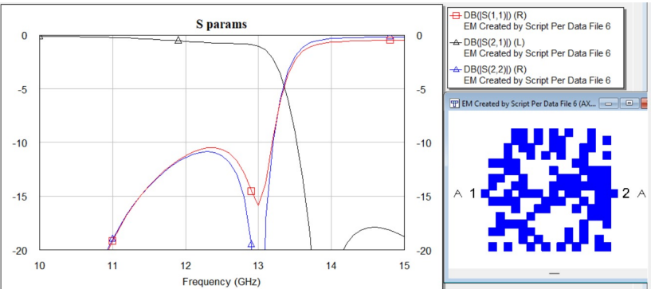

# Deep-Learning-assisted-RF-Filter-Design
Generating an Electrical Filter Design in a pixelated design space with a genetic algorithm, and rapid evaluation via a CNN.
This project explores machine learning for the design of Radio Frequency (RF) filters. By leveraging convolutional neural networks (CNNs) and genetic algorithms (GAs), we aim to design RF filters with specific scattering parameter requirements. The design space is a pixelated metal sheet over a substrate, that via intricate selection of nontrivial arbitrary-seeming pixel patterns and the complex EM interactions between them we're able to satisfy filter requirements. No analytical model for the design space exists. 
## Why Use Machine Learning for RF Filter Design?
Conventional RF filter design techniques involve manually selecting configurations and parameter sweeps, which are time-consuming and limited by human expertise. Machine learning expands the design space significantly by automating and optimizing design generation. Also, I'm personally more interested in Machine Learning and wanted to try my hand at coding a Genetic Algorithm.
## Approach
The filter-fabrication pipeline is comprised of several programmatic components, that are built on top of each other.
first, we build a dataset of arbitrary Electromagnetic Structures inside AWR with an automated script that was coded in python using an API, and visual basic, inside of AWR itself. The script generates sets of samples, due to theamount of samples and complexity of EM simulation the set generation requires an immense amount of computation and generation time.
We export the sets to .csv files, which we subsequently open in Python. Each .csv file contains 10, 000 samples (unless a run was interrupted) and their scattering parameters over 195 frequency points.
Inside Python, we perform prepossessing - both changing the way the data is presented to be compatible with Python's numpy and PyTorch libraries, and using the passivity of the scattering-parameters to triple the amount of training and validation samples. Our code lets us select discrete frequency points, modify the CNN and optimization process to revolve solely around them (due to high compute requirements).

  

<strong>Figure 1: using passivity and symmetry in pixelated RF structures to triple the dataset, flipped structures have similar/transformed scattering parameters</strong>

The data, now saved as a PyTorch (A Python machine learning library) dataset, is used to train a convolutional neural network to estimate the frequency response parameters of the structures.
The CNN's accuracy was improved with the use of point-wise convolutions, a design element not previously present in any of the articles.
The weights of the trained model are saved, and the model is loaded into a Genetic Algorithm which optimizes designs based on their predicted frequency response by the model.
The selection process is done via tournament selection based on the cost function, crossover, and mutation - which contain unique considerations for port location and mutation.
The iteration process is repeated for N generations, afterwards the best filter according to the CNN and the cost function is presented to the user. 
Optimization time is greatly minimized via the use of Min-Heaps to select the k-best designs. 

  
  
  <strong> Figure 2: the overall design pipeline, a genetic algorithm based on a CNN</strong>

For an in-depth overview of every pipeline element as well as design process, please look at the Project Report.

## Architecture

1. **Data Generation**: Using AWR and Python scripts, a large dataset of 450,000 structures is generated and their scattering parameters simulated. These structures are represented as 16x16 binary matrices. 
   
2. **CNN for Parameter Prediction**: A CNN is trained to predict the scattering parameters of these structures. The architecture consists of convolutional interspersed with Batch-Norm layers, followed by a point-wise convolution into fully connected layers, achieving a 0.38 dB MAE on test data. Consistently, the addition of data has yielded vastly better performance - we believe more data will lead to a viable pipeline.

3. **Genetic Algorithm for Optimization**: The GA evolves filter designs by iteratively selecting and mutating structures. It uses a score function based on how well the predicted scattering parameters meet design requirements.

## Files 

| File                           | Description                                                                                          |
|---------------------------------|------------------------------------------------------------------------------------------------------|
|**project Report**               | Contains detailed breakdown of the design process, theoretical foundations, use instructions for code.                       |
|**assets**                       | Folder containing the images used in this repository                                                 |
| **dataset_importer_2.py**       | This file combines the .csv files, selects frequencies.                                              |
| **CustomDataset.py**            | Packages the data into a PyTorch dataset structure, and generates more samples with symmetry                              |
| **cnn_model.py**        |    contains model design. cnn_model_1_conv uses a 1x1 convolution layer to cut down on the parameters in the FC down the line and speed up training time   - recommended model |          
| **dataset_preprocessing.py**    | Preprocesses the generated dataset for training.                                                      |
| **compare_cnns_2.py**              | Allows one to train multiple CNN networks sequentially, the results of the run are saved into a .json file inside a directory called training_results.json |
| **seed_generator.py**            | Contains supporting functions for the Genetic Algorithm |
| **genetic_algorithm_size_adjusted.py** | Contains the bulk of the Genetic Algorithm code.|
| **main.py**                     | Loads the CNN, runs the Genetic Algorithm, outputs the chosen matrix, its s-parameter prediction.                           |
| **Weights.rar**| The weights of the best trained model - file is named FR_1_conv_truly_cnn_model_1_conv, you can tell by the naming conventions I performed A LOT of runs 😅| 
| **Worlds of hardware Project Poster**| we presented our work at the Worlds of Hardware 2024 conference. Our poster design. |

This Repo was written by Aylon Feraru and contains his contributions to the project, to get the raw dataset, and dataset simulation files, contact Dan Fishler. 

## Results
- **Accuracy**: Our CNN achieved a Mean Absolute Error (MAE) of 0.38 dB on the prediction of scattering parameters, for a 16x16 design space. With a greater amount of pixels, prediction complexity increases, but with the addition of samples loss decreases significantly - comparison with other projects leads us to believe more samples are required.
  

  
  
  <strong> Figure 3: training and validation loss curves on the final training run.</strong>
  

| **Important to note**: continued improvement with more data | **Our Work** | **Tandem Neural Network Based Design of Multiband Antennas** | **Deep-Learning-Based Inverse-Designed Millimeter-Wave Passives and Power Amplifiers** |
| :----------------------------------------------------------: | :----------: | :----------------------------------------------------------: | :----------------------------------------------------------------------------------: |
| **Samples**              | 450,000    | 500,000  | 804,000    |
| **Size of EM structure**  | 16 x 16    | 12 x 12  | 16 x 16    |
| **# of ports**            | 2          | 1        | 4 (effectively 2) |
| **S parameter prediction format** | dB | dB | Re/Im |
| **Parameters predicted**  | S11, S12, S22 | S11 only | S11, S12, S22 |
| **Structure**             | CNN, with pointwise convolution | Similar CNN, no pointwise convolution | CNN, with 5 FC layers connected after |
| **Viable for prediction** | Verging on viability | Viable | Viable |

<strong>The prediction problem is SIGNIFICANTLY harder compared to the antenna team, data & compute MUCH smaller compared to both.</strong>

- **Optimization**: The GA successfully optimized filter designs, approaching the desired RF characteristics but 
  

  
  
  <strong> Figure 3: A pixel structure approaching desired S-parameter Characteristics.</strong>
  

  
Performance can be further improved with a larger dataset and extended training.

## References

1. E. A. Karahan et al., “Deep-learning-based inverse-designed millimeter-wave passives and power amplifiers,” *IEEE Journal of Solid-State Circuits*, 2023.
2. A. Gupta et al., “Tandem neural network based design of multiband antennas,” *IEEE Transactions on Antennas and Propagation*, 2023.
3. Y. Li et al., “Predicting scattering from complex nano-structures via deep learning,” *IEEE Access*, 2020.
